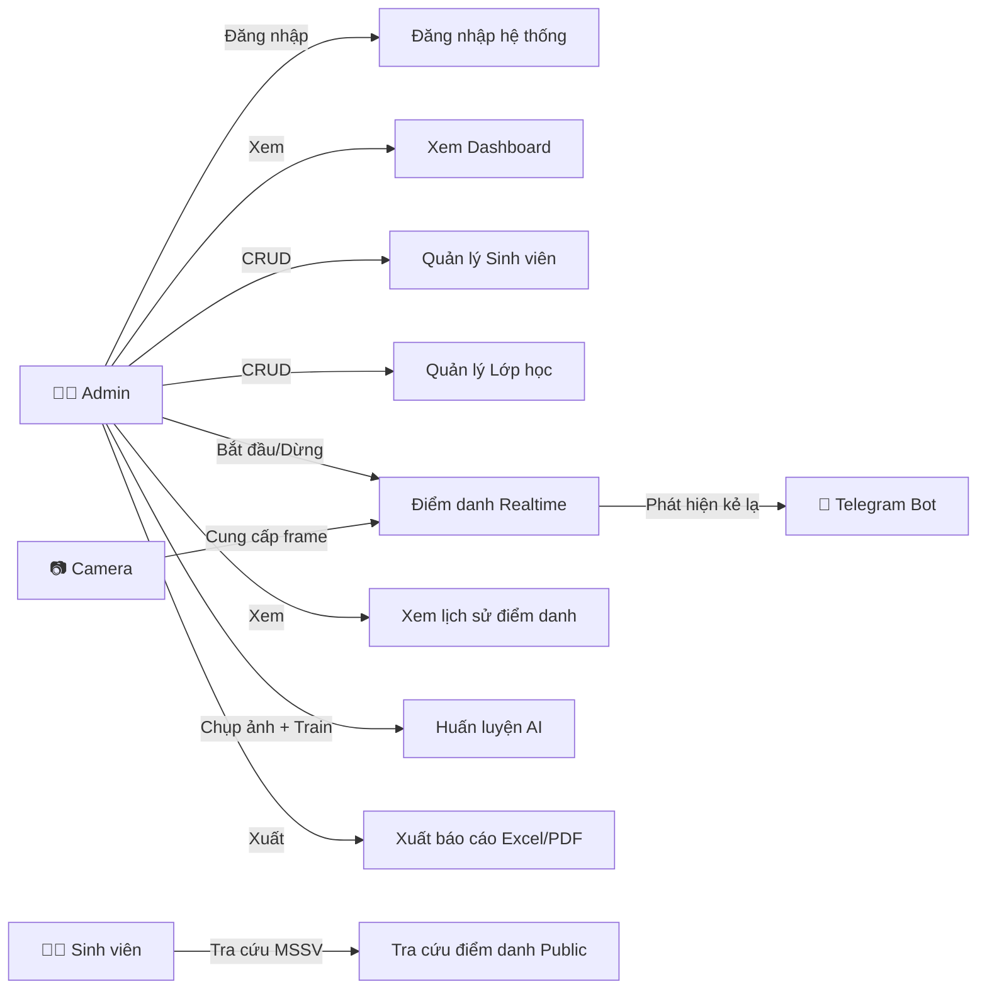
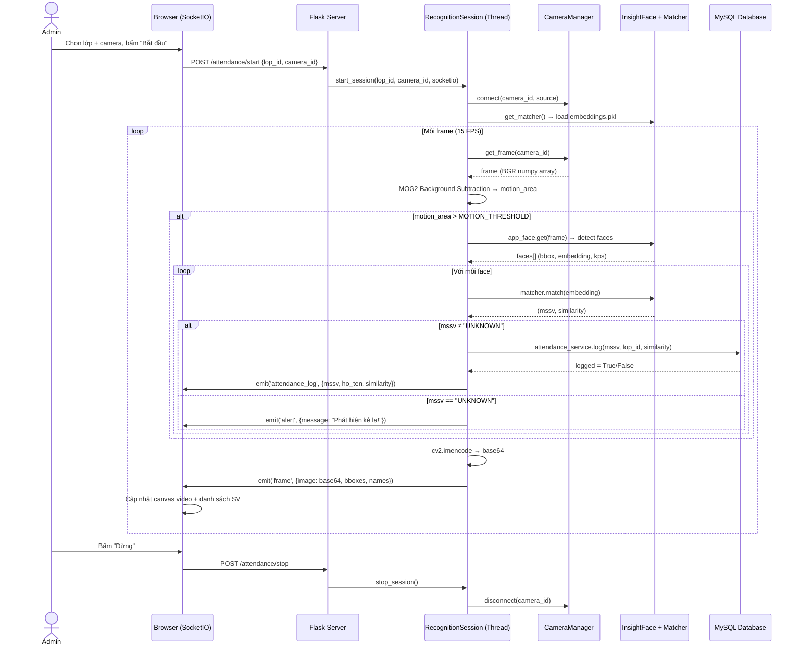
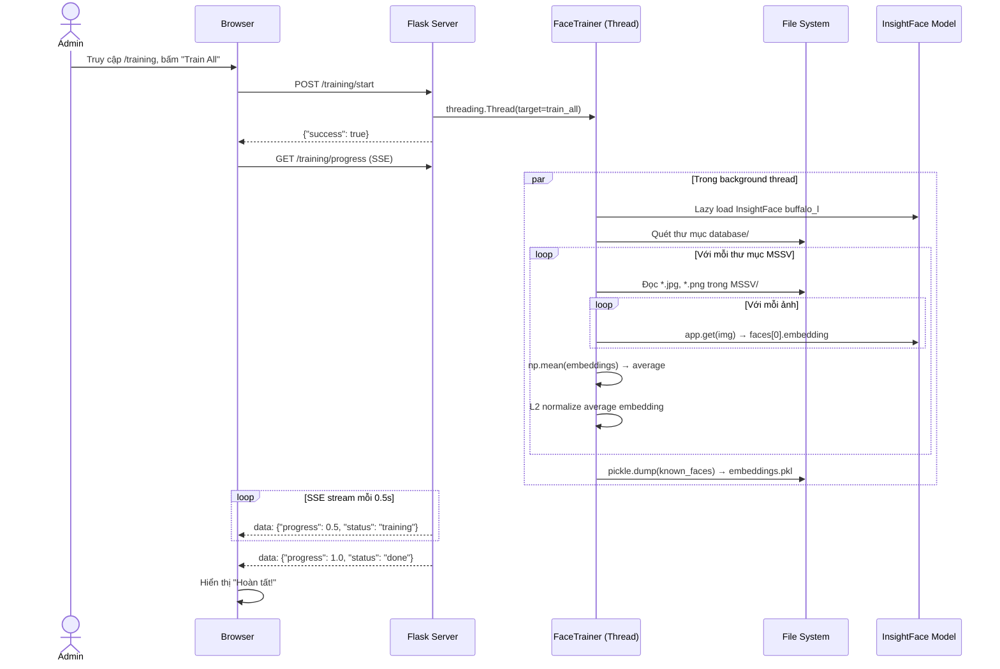
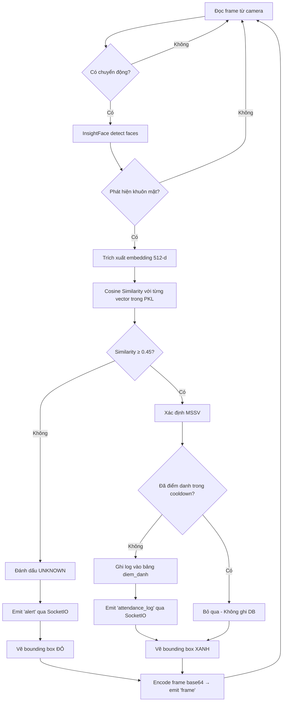
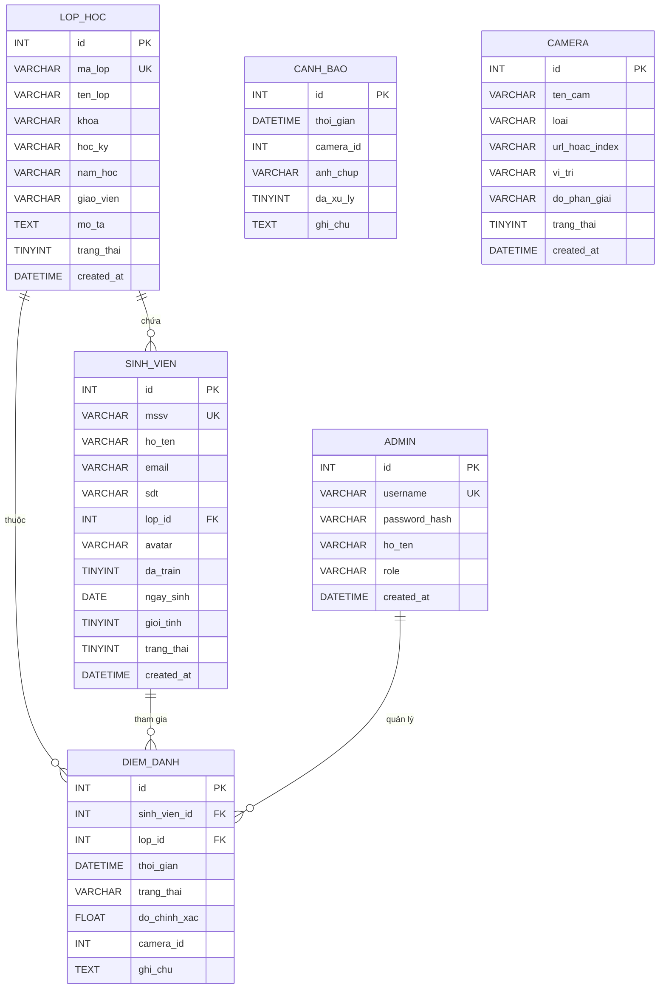

# BÁO CÁO ĐỒ ÁN

# HỆ THỐNG ĐIỂM DANH THÔNG MINH BẰNG NHẬN DIỆN KHUÔN MẶT ỨNG DỤNG TRÍ TUỆ NHÂN TẠO

---

> **Sinh viên thực hiện:** [Họ và tên sinh viên]
> **MSSV:** [Mã số sinh viên]
> **Lớp:** [Tên lớp]
> **Giảng viên hướng dẫn:** [Họ và tên GVHD]
> **Niên khóa:** 2025 – 2026

---

## MỤC LỤC

- [Chương 1: MỞ ĐẦU](#chương-1-mở-đầu)
- [Chương 2: CƠ SỞ LÝ THUYẾT](#chương-2-cơ-sở-lý-thuyết)
- [Chương 3: PHÂN TÍCH VÀ THIẾT KẾ HỆ THỐNG](#chương-3-phân-tích-và-thiết-kế-hệ-thống)
- [Chương 4: THIẾT KẾ CƠ SỞ DỮ LIỆU](#chương-4-thiết-kế-cơ-sở-dữ-liệu)
- [Chương 5: TRIỂN KHAI VÀ CÀI ĐẶT](#chương-5-triển-khai-và-cài-đặt)
- [Chương 6: KẾT QUẢ THỬ NGHIỆM VÀ ĐÁNH GIÁ](#chương-6-kết-quả-thử-nghiệm-và-đánh-giá)
- [Chương 7: KẾT LUẬN VÀ HƯỚNG PHÁT TRIỂN](#chương-7-kết-luận-và-hướng-phát-triển)
- [TÀI LIỆU THAM KHẢO](#tài-liệu-tham-khảo)

---

## DANH MỤC HÌNH ẢNH

| STT | Hình | Mô tả |
|-----|------|--------|
| 1 | Hình 2.1 | Kiến trúc mạng SCRFD (Sample and Computation Redistribution for Face Detection) |
| 2 | Hình 2.2 | Pipeline trích xuất Face Embedding 512 chiều bằng ArcFace |
| 3 | Hình 2.3 | Minh họa Cosine Similarity giữa hai vector embedding |
| 4 | Hình 2.4 | Mô hình MVC (Model – View – Controller) |
| 5 | Hình 3.1 | Sơ đồ Use Case tổng quát hệ thống |
| 6 | Hình 3.2 | Sơ đồ kiến trúc tổng thể hệ thống |
| 7 | Hình 3.3 | Sơ đồ tuần tự (Sequence Diagram) – Luồng điểm danh realtime |
| 8 | Hình 3.4 | Sơ đồ tuần tự – Luồng huấn luyện AI |
| 9 | Hình 3.5 | Sơ đồ hoạt động (Activity Diagram) – Quy trình nhận diện |
| 10 | Hình 4.1 | Sơ đồ ERD cơ sở dữ liệu |
| 11 | Hình 5.1 | Giao diện trang đăng nhập |
| 12 | Hình 5.2 | Giao diện Dashboard tổng quan |
| 13 | Hình 5.3 | Giao diện điểm danh Realtime |
| 14 | Hình 5.4 | Giao diện quản lý sinh viên |
| 15 | Hình 5.5 | Giao diện huấn luyện AI |
| 16 | Hình 5.6 | Giao diện xuất báo cáo Excel/PDF |

## DANH MỤC BẢNG

| STT | Bảng | Mô tả |
|-----|------|--------|
| 1 | Bảng 2.1 | So sánh các phương pháp nhận diện khuôn mặt |
| 2 | Bảng 3.1 | Danh sách các module chức năng hệ thống |
| 3 | Bảng 4.1 | Cấu trúc bảng `lop_hoc` |
| 4 | Bảng 4.2 | Cấu trúc bảng `sinh_vien` |
| 5 | Bảng 4.3 | Cấu trúc bảng `diem_danh` |
| 6 | Bảng 4.4 | Cấu trúc bảng `canh_bao` |
| 7 | Bảng 4.5 | Cấu trúc bảng `camera` |
| 8 | Bảng 4.6 | Cấu trúc bảng `admin` |
| 9 | Bảng 5.1 | Danh sách các thư viện Python sử dụng |
| 10 | Bảng 6.1 | Kết quả thử nghiệm độ chính xác nhận diện |

## DANH MỤC TỪ VIẾT TẮT

| Từ viết tắt | Ý nghĩa |
|-------------|---------|
| AI | Artificial Intelligence – Trí tuệ nhân tạo |
| MSSV | Mã số sinh viên |
| SCRFD | Sample and Computation Redistribution for Face Detection |
| ArcFace | Additive Angular Margin Loss for Deep Face Recognition |
| CNN | Convolutional Neural Network – Mạng nơ-ron tích chập |
| ONNX | Open Neural Network Exchange |
| CSDL | Cơ sở dữ liệu |
| MVC | Model – View – Controller |
| REST | Representational State Transfer |
| API | Application Programming Interface |
| CRUD | Create – Read – Update – Delete |
| SSE | Server-Sent Events |
| FPS | Frames Per Second – Số khung hình mỗi giây |
| RBAC | Role-Based Access Control – Kiểm soát truy cập dựa trên vai trò |
| ERD | Entity-Relationship Diagram – Sơ đồ thực thể quan hệ |

---

## Chương 1: MỞ ĐẦU

### 1.1. Lý do chọn đề tài

Trong bối cảnh chuyển đổi số giáo dục đại học đang diễn ra mạnh mẽ tại Việt Nam, việc số hóa và tự động hóa các quy trình quản lý học vụ trở thành nhu cầu tất yếu. Điểm danh – một công việc tưởng chừng đơn giản nhưng lại chiếm nhiều thời gian của giảng viên và tiềm ẩn nhiều bất cập khi thực hiện thủ công:

- **Tốn thời gian:** Mỗi buổi học, giảng viên phải mất 5–10 phút để gọi tên từng sinh viên, ảnh hưởng đến thời lượng giảng dạy.
- **Thiếu chính xác:** Sinh viên có thể nhờ bạn điểm danh hộ (gian lận), đặc biệt với lớp đông trên 50 sinh viên.
- **Khó quản lý:** Dữ liệu điểm danh bằng giấy khó tổng hợp, tra cứu, và thống kê cuối kỳ.
- **An ninh trường học:** Nhiều trường đại học gặp khó khăn trong việc kiểm soát người lạ ra vào khuôn viên.

Với sự phát triển vượt bậc của trí tuệ nhân tạo (AI), đặc biệt là trong lĩnh vực thị giác máy tính (Computer Vision) và nhận diện khuôn mặt (Face Recognition), bài toán điểm danh tự động trở nên hoàn toàn khả thi. Các mô hình deep learning hiện đại như **InsightFace** với backbone **ArcFace** đã đạt được độ chính xác trên 99% trên các bộ dữ liệu benchmark chuẩn quốc tế (LFW, CFP-FP, AgeDB-30).

Xuất phát từ thực tế trên, đề tài **"Hệ thống điểm danh thông minh bằng nhận diện khuôn mặt ứng dụng trí tuệ nhân tạo"** được lựa chọn nhằm xây dựng một giải pháp tự động hóa hoàn toàn quy trình điểm danh, kết hợp giám sát an ninh phát hiện người lạ trong môi trường trường học.

### 1.2. Mục tiêu đề tài

**Mục tiêu tổng quát:**
Xây dựng hệ thống điểm danh tự động sử dụng công nghệ nhận diện khuôn mặt bằng AI, được triển khai dưới dạng ứng dụng web hoàn chỉnh, phục vụ quản lý điểm danh sinh viên và giám sát an ninh tại môi trường giáo dục.

**Mục tiêu cụ thể:**

1. **Nhận diện khuôn mặt realtime:** Phát hiện và nhận diện chính xác khuôn mặt sinh viên từ camera trong thời gian thực, tự động ghi nhận điểm danh với độ chính xác cao.

2. **Hệ thống quản lý web:** Xây dựng giao diện web quản trị để quản lý sinh viên, lớp học, lịch sử điểm danh với đầy đủ chức năng CRUD.

3. **Huấn luyện AI linh hoạt:** Cho phép admin chụp ảnh, upload ảnh sinh viên và huấn luyện mô hình AI trực tiếp từ giao diện web mà không cần kiến thức lập trình.

4. **Cảnh báo an ninh:** Phát hiện và ghi nhận người lạ (không có trong cơ sở dữ liệu), gửi cảnh báo qua Telegram Bot.

5. **Xuất báo cáo:** Hỗ trợ xuất bảng điểm danh ra file Excel (.xlsx) và PDF, bao gồm bảng điểm danh theo ngày, danh sách lớp (roster), và ma trận điểm danh theo tháng.

6. **Tra cứu công khai:** Cung cấp giao diện public để sinh viên tự tra cứu lịch sử điểm danh cá nhân bằng MSSV.

### 1.3. Đối tượng và phạm vi nghiên cứu

**Đối tượng nghiên cứu:**
- Công nghệ nhận diện khuôn mặt bằng deep learning (InsightFace, ArcFace)
- Các giải thuật phát hiện khuôn mặt SCRFD
- Phương pháp trích xuất và so khớp vector embedding
- Kiến trúc ứng dụng web MVC sử dụng Flask (Python)

**Phạm vi nghiên cứu:**
- Hệ thống được thiết kế cho quy mô vừa và nhỏ (tối đa 500 sinh viên)
- Nhận diện từ camera USB hoặc IP camera với điều kiện ánh sáng thông thường
- Triển khai trên máy tính cá nhân/server nội bộ (localhost hoặc LAN)
- Hỗ trợ nhận diện từ 1 camera tại một thời điểm

### 1.4. Phương pháp nghiên cứu

- **Nghiên cứu lý thuyết:** Tìm hiểu các công trình nghiên cứu và bài báo khoa học về nhận diện khuôn mặt (ArcFace, SCRFD, InsightFace).
- **Phương pháp thực nghiệm:** Xây dựng hệ thống hoàn chỉnh, thu thập dữ liệu thực tế và đánh giá hiệu năng.
- **Phương pháp phân tích và thiết kế hướng đối tượng:** Sử dụng UML (Use Case Diagram, Sequence Diagram, Activity Diagram, Class Diagram) để mô hình hóa hệ thống.

### 1.5. Bố cục đồ án

Đồ án được chia thành 7 chương:

| Chương | Nội dung |
|--------|----------|
| Chương 1 | Mở đầu – Giới thiệu đề tài, mục tiêu, phạm vi |
| Chương 2 | Cơ sở lý thuyết – Nền tảng kỹ thuật nhận diện khuôn mặt và công nghệ sử dụng |
| Chương 3 | Phân tích và thiết kế hệ thống – Kiến trúc, sơ đồ UML, thiết kế module |
| Chương 4 | Thiết kế cơ sở dữ liệu – ERD, cấu trúc bảng, quan hệ |
| Chương 5 | Triển khai và cài đặt – Chi tiết mã nguồn, giao diện, tích hợp |
| Chương 6 | Kết quả thử nghiệm và đánh giá – Thử nghiệm thực tế, benchmark |
| Chương 7 | Kết luận và hướng phát triển – Tổng kết, hạn chế, định hướng tương lai |

---

## Chương 2: CƠ SỞ LÝ THUYẾT

### 2.1. Tổng quan về nhận diện khuôn mặt

Nhận diện khuôn mặt (Face Recognition) là một bài toán trong lĩnh vực thị giác máy tính (Computer Vision), nhằm xác định danh tính của một người dựa trên đặc trưng khuôn mặt trong ảnh hoặc video. Đây là một bài toán phức tạp vì khuôn mặt người chịu ảnh hưởng bởi nhiều yếu tố: góc nghiêng, ánh sáng, biểu cảm, phụ kiện (kính, khẩu trang), và sự thay đổi theo thời gian (lão hóa).

Quy trình nhận diện khuôn mặt thường bao gồm 4 bước chính:

```
┌──────────┐    ┌──────────────┐    ┌──────────────────┐    ┌──────────────┐
│  Input   │───▶│ Face         │───▶│ Feature          │───▶│ Face         │
│  Image   │    │ Detection    │    │ Extraction       │    │ Matching     │
│          │    │ (SCRFD)      │    │ (ArcFace 512-d)  │    │ (Cosine Sim) │
└──────────┘    └──────────────┘    └──────────────────┘    └──────────────┘
```

1. **Face Detection:** Phát hiện vị trí và vùng chứa khuôn mặt trong ảnh.
2. **Face Alignment:** Căn chỉnh khuôn mặt về dạng chuẩn (normalization).
3. **Feature Extraction:** Trích xuất vector đặc trưng (embedding) biểu diễn khuôn mặt.
4. **Face Matching:** So sánh embedding với cơ sở dữ liệu để xác định danh tính.

### 2.2. Mô hình InsightFace

#### 2.2.1. Giới thiệu

**InsightFace** là một thư viện mã nguồn mở chuyên dụng cho bài toán nhận diện khuôn mặt, được phát triển bởi nhóm nghiên cứu của Jia Guo và các cộng sự. InsightFace tích hợp nhiều mô hình state-of-the-art bao gồm phát hiện khuôn mặt (Face Detection), nhận diện khuôn mặt (Face Recognition), phân tích thuộc tính khuôn mặt (Face Analysis), và nhiều tác vụ khác.

Trong đồ án này, hệ thống sử dụng **InsightFace Buffalo_L** – một model pack bao gồm:
- **SCRFD (det_10g):** Phát hiện khuôn mặt
- **ArcFace (recognition model):** Trích xuất embedding 512 chiều

#### 2.2.2. SCRFD – Phát hiện khuôn mặt (Face Detection)

**SCRFD** (Sample and Computation Redistribution for Face Detection) là một kiến trúc phát hiện khuôn mặt hiệu quả, được đề xuất bởi InsightFace team tại bài báo *"Sample and Computation Redistribution for Efficient Face Detection"* (2021).

Đặc điểm nổi bật của SCRFD:
- **Nhẹ và nhanh:** Thiết kế tối ưu cho tốc độ, phù hợp ứng dụng realtime.
- **Anchor-free detection:** Không phụ thuộc vào anchor boxes truyền thống.
- **Multi-scale detection:** Phát hiện khuôn mặt ở nhiều kích thước khác nhau.
- **Landmark detection:** Đồng thời phát hiện 5 điểm mốc (keypoints) trên khuôn mặt (2 mắt, 1 mũi, 2 khóe miệng) phục vụ face alignment.

Trong hệ thống, SCRFD được cấu hình với `det_size=(640, 640)` để cân bằng giữa tốc độ và độ chính xác:

```python
# core/detector.py
self._app = FaceAnalysis(
    name='buffalo_l',
    providers=['CPUExecutionProvider']
)
self._app.prepare(ctx_id=0, det_size=(640, 640))
```

#### 2.2.3. ArcFace – Trích xuất đặc trưng (Feature Extraction)

**ArcFace** (Additive Angular Margin Loss for Deep Face Recognition) là phương pháp learning metric được đề xuất trong bài báo *"ArcFace: Additive Angular Margin Loss for Deep Face Recognition"* (Deng et al., 2019). ArcFace thuộc nhóm margin-based loss functions, cải tiến từ SphereFace (A-Softmax) và CosFace (Large Margin Cosine Loss).

**Nguyên lý hoạt động:**

ArcFace thêm một **angular margin** (biên góc) vào hàm mất mát softmax truyền thống, buộc mô hình phải học các vector embedding có tính phân biệt cao hơn. Công thức hàm mất mát ArcFace:

```
L = -log( e^(s·cos(θ_yi + m)) / (e^(s·cos(θ_yi + m)) + Σ e^(s·cos(θ_j))) )
```

Trong đó:
- `θ_yi`: Góc giữa vector embedding và class center tương ứng
- `m`: Angular margin (thường m = 0.5)
- `s`: Scale factor (thường s = 64)

**Kết quả:** Mỗi khuôn mặt được biểu diễn bằng một vector **512 chiều** (512-dimensional embedding), được chuẩn hóa L2 (L2 normalized) để vector nằm trên hypersphere đơn vị.

```python
# core/embedder.py
embedding = faces[0].embedding
# L2 Normalize để chuẩn hóa vector
norm = np.linalg.norm(embedding)
if norm > 0:
    embedding = embedding / norm
```

### 2.3. Phương pháp so khớp khuôn mặt (Face Matching)

#### 2.3.1. Cosine Similarity

Hệ thống sử dụng **Cosine Similarity** để đo độ tương đồng giữa hai embedding vector. Cosine similarity đo góc giữa hai vector trong không gian nhiều chiều, bất kể độ lớn (magnitude) của chúng:

```
cos(A, B) = (A · B) / (||A|| × ||B||)
```

Trong đó:
- `A · B` là tích vô hướng (dot product) của hai vector
- `||A||` và `||B||` là norm L2 của mỗi vector
- Kết quả nằm trong khoảng [-1, 1], trong đó 1 = giống hoàn toàn, 0 = không liên quan, -1 = hoàn toàn ngược

```python
# core/matcher.py
sim = np.dot(embedding, known_emb) / (
    np.linalg.norm(embedding) * np.linalg.norm(known_emb)
)
if sim > best_sim and sim > threshold:
    best_sim = float(sim)
    best_match = mssv
```

#### 2.3.2. Ngưỡng nhận diện (Threshold)

Hệ thống sử dụng ngưỡng similarity mặc định là **0.45** (cấu hình qua biến môi trường `SIMILARITY_THRESHOLD`). Nghĩa là:
- Nếu `similarity ≥ 0.45` → Nhận diện thành công, xác định được sinh viên.
- Nếu `similarity < 0.45` → Không nhận ra, đánh dấu là "Kẻ lạ" (UNKNOWN).

Ngưỡng này được chọn dựa trên thực nghiệm, cân bằng giữa:
- **False Positive Rate (FPR):** Nhận sai người → ngưỡng quá thấp.
- **False Negative Rate (FNR):** Không nhận ra người → ngưỡng quá cao.

#### 2.3.3. Average Embedding

Để tăng độ chính xác, hệ thống sử dụng kỹ thuật **Average Embedding** khi huấn luyện. Thay vì chỉ sử dụng 1 ảnh cho mỗi sinh viên, hệ thống chụp nhiều ảnh từ nhiều góc độ và tính vector **trung bình cộng (average)**:

```python
# core/trainer.py
if len(emb_list) == 1:
    known_faces[ma_sv] = emb_list[0]
else:
    avg_emb = np.mean(emb_list, axis=0)
    avg_emb = avg_emb / np.linalg.norm(avg_emb)  # L2 Normalize
    known_faces[ma_sv] = avg_emb
```

Lợi ích:
- Giảm nhiễu từ các điều kiện khác nhau (ánh sáng, góc nhìn, biểu cảm)
- Tạo ra vector embedding ổn định hơn, đại diện tốt hơn cho khuôn mặt thực tế của sinh viên

### 2.4. Motion Detection

Hệ thống tích hợp **Background Subtractor MOG2** (Mixture of Gaussians) để phát hiện chuyển động trước khi chạy nhận diện khuôn mặt. Đây là chiến lược tối ưu hiệu năng quan trọng:

```python
# services/recognition_thread.py
self._bg_subtractor = cv2.createBackgroundSubtractorMOG2(
    history=500, varThreshold=50, detectShadows=True
)

# Chỉ chạy AI khi có chuyển động đáng kể
fg_mask = self._bg_subtractor.apply(frame)
motion_area = cv2.countNonZero(fg_mask)
if motion_area > Config.MOTION_AREA_THRESHOLD:
    faces = app_face.get(frame)  # Chỉ chạy InsightFace khi có motion
```

Khi không có ai di chuyển trước camera, hệ thống **không gọi InsightFace**, tiết kiệm đáng kể tài nguyên CPU.

### 2.5. Công nghệ sử dụng

#### 2.5.1. Bảng so sánh các phương pháp nhận diện khuôn mặt

**Bảng 2.1: So sánh các phương pháp nhận diện khuôn mặt**

| Tiêu chí | Haar Cascade + LBPH | dlib + HOG | InsightFace (ArcFace) |
|----------|---------------------|------------|------------------------|
| Độ chính xác | ~70% | ~85% | **>99%** |
| Tốc độ (CPU) | Rất nhanh | Nhanh | Trung bình |
| Robust với ánh sáng | Kém | Trung bình | **Tốt** |
| Robust với góc nghiêng | Kém | Trung bình | **Tốt** |
| Kích thước embedding | - | 128-d | **512-d** |
| Yêu cầu phần cứng | Thấp | Trung bình | Trung bình – Cao |
| **Lựa chọn cho đồ án** | ❌ | ❌ | ✅ |

#### 2.5.2. Nền tảng và framework

| Thành phần | Công nghệ | Phiên bản | Vai trò |
|------------|-----------|-----------|---------|
| Ngôn ngữ | Python | ≥ 3.10 | Ngôn ngữ chính |
| Web Framework | Flask | ≥ 3.0 | Backend web server |
| AI Engine | InsightFace | ≥ 0.7.3 | Nhận diện khuôn mặt |
| AI Runtime | ONNX Runtime | ≥ 1.17 | Chạy mô hình AI tối ưu |
| Computer Vision | OpenCV | ≥ 4.9 | Xử lý ảnh, camera |
| Database | MySQL | ≥ 8.0 | Lưu trữ dữ liệu |
| WebSocket | Flask-SocketIO | ≥ 5.3 | Giao tiếp realtime |
| Async Engine | Eventlet | ≥ 0.35 | Xử lý bất đồng bộ |
| Báo cáo Excel | OpenPyXL | ≥ 3.1 | Xuất file .xlsx |
| Báo cáo PDF | ReportLab | ≥ 4.1 | Xuất file .pdf |
| Frontend | Bootstrap + Chart.js | 5.x / 4.x | Giao diện responsive |

#### 2.5.3. Kiến trúc MVC

Hệ thống được xây dựng theo mô hình **MVC (Model – View – Controller)** kết hợp với **Service Layer Pattern**:

```
┌─────────────────────────────────────────────────────┐
│                   CLIENT (Browser)                   │
│         HTML/CSS/JavaScript + WebSocket              │
└──────────────────────┬──────────────────────────────┘
                       │ HTTP / WebSocket
┌──────────────────────▼──────────────────────────────┐
│                 CONTROLLER (Routes)                  │
│  auth.py | dashboard.py | students.py | classes.py   │
│  attendance.py | training.py | export.py | public.py │
└──────────────────────┬──────────────────────────────┘
                       │
┌──────────────────────▼──────────────────────────────┐
│                  SERVICE LAYER                       │
│  student_service | class_service | attendance_service│
│  export_service | recognition_thread                 │
└──────────────────────┬──────────────────────────────┘
                       │
┌──────────────────────▼──────────────────────────────┐
│                     CORE AI                          │
│   detector.py | embedder.py | matcher.py | trainer.py│
│                  camera.py                           │
└──────────────────────┬──────────────────────────────┘
                       │
┌──────────────────────▼──────────────────────────────┐
│              DATA LAYER (MySQL + File System)        │
│        db/connection.py | Connection Pooling         │
│        database/ (ảnh sinh viên) | models/ (pkl)     │
└─────────────────────────────────────────────────────┘
```

---

## Chương 3: PHÂN TÍCH VÀ THIẾT KẾ HỆ THỐNG

### 3.1. Phân tích yêu cầu hệ thống

#### 3.1.1. Yêu cầu chức năng

| STT | Module | Chức năng | Mô tả |
|-----|--------|-----------|--------|
| F1 | Xác thực | Đăng nhập / Đăng xuất | Admin đăng nhập bằng username + password (bcrypt hash) |
| F2 | Dashboard | Tổng quan hệ thống | Hiển thị thống kê hôm nay, biểu đồ 7 ngày, top SV vắng |
| F3 | Sinh viên | CRUD sinh viên | Thêm, sửa, xóa, xem danh sách + chi tiết sinh viên |
| F4 | Lớp học | CRUD lớp học | Thêm, sửa, xóa, xem danh sách lớp học kèm sĩ số |
| F5 | Điểm danh | Điểm danh realtime | Camera nhận diện, tự động ghi log, hiển thị live feed |
| F6 | Điểm danh | Lịch sử điểm danh | Xem, lọc, tìm kiếm lịch sử điểm danh theo lớp/ngày/MSSV |
| F7 | Training | Chụp ảnh sinh viên | Chụp ảnh khuôn mặt qua webcam, lưu vào hệ thống |
| F8 | Training | Huấn luyện AI | Train toàn bộ hoặc train riêng 1 sinh viên |
| F9 | Xuất | Xuất Excel/PDF | Xuất bảng điểm danh theo ngày |
| F10 | Xuất | Xuất roster | Xuất danh sách lớp trắng |
| F11 | Xuất | Xuất ma trận tháng | Xuất bảng điểm danh tổng hợp theo tháng |
| F12 | Cảnh báo | Phát hiện người lạ | Phát hiện khuôn mặt không có trong DB, cảnh báo Telegram |
| F13 | Public | Tra cứu điểm danh | Sinh viên tự tra cứu bằng MSSV (không cần đăng nhập) |

#### 3.1.2. Yêu cầu phi chức năng

| STT | Yêu cầu | Mô tả |
|-----|---------|--------|
| NF1 | Hiệu năng | Nhận diện ≤ 2 giây/frame, giới hạn 15 FPS |
| NF2 | Bảo mật | Mã hóa mật khẩu bcrypt, session-based authentication |
| NF3 | Giao diện | Responsive, dark mode, Glassmorphism UI |
| NF4 | Ổn định | Thread-safe, connection pooling, singleton pattern |
| NF5 | Khả năng mở rộng | Hỗ trợ multi-camera, RBAC (Admin/Teacher) |
| NF6 | Dữ liệu | Hỗ trợ UTF-8 đầy đủ (tiếng Việt), Unicode path |

### 3.2. Sơ đồ Use Case

#### 3.2.1. Use Case tổng quát



#### 3.2.2. Đặc tả Use Case chính: Điểm danh Realtime

| Thuộc tính | Mô tả |
|------------|--------|
| **Tên UC** | Điểm danh Realtime |
| **Actor** | Admin (Primary), Camera (Supporting) |
| **Mô tả** | Admin chọn lớp, chọn camera, bấm "Bắt đầu điểm danh". Hệ thống tự động nhận diện khuôn mặt và ghi log. |
| **Tiền điều kiện** | Admin đã đăng nhập. Mô hình AI đã được train (file embeddings.pkl tồn tại). Camera khả dụng. |
| **Luồng chính** | 1. Admin chọn lớp học từ dropdown → 2. Admin chọn camera → 3. Admin bấm "Bắt đầu" → 4. Hệ thống kết nối camera, bắt đầu background thread → 5. Thread đọc frame, detect faces, match embedding → 6. Nếu match → ghi log điểm danh, emit sự kiện "attendance_log" → 7. Encode frame base64, emit sự kiện "frame" → 8. Client nhận và hiển thị video + danh sách SV đã điểm danh |
| **Luồng ngoại lệ** | 5a. Motion = 0 → bỏ qua frame, không gọi AI. 6a. Duplicate check → nếu SV đã điểm danh trong cooldown → bỏ qua. 6b. Khuôn mặt không nhận ra → emit "alert", vẽ box đỏ |
| **Hậu điều kiện** | Dữ liệu điểm danh được lưu vào bảng `diem_danh` |

### 3.3. Thiết kế kiến trúc hệ thống

#### 3.3.1. Kiến trúc tổng thể

Hệ thống được thiết kế theo mô hình **4 tầng** (4-Layer Architecture):

| Tầng | Thành phần | Công nghệ |
|------|-----------|-----------|
| **Presentation Layer** | Templates (HTML/CSS/JS), WebSocket Client | Jinja2, Bootstrap 5, Chart.js, SocketIO Client |
| **Controller Layer** | Flask Blueprints (Routes) | Flask ≥ 3.0 |
| **Business Logic Layer** | Services + Core AI | Python, InsightFace, OpenCV |
| **Data Access Layer** | Database Connection Pool | MySQL + mysql-connector-python |

#### 3.3.2. Danh sách Blueprints (Routes)

**Bảng 3.1: Danh sách các module chức năng hệ thống**

| Blueprint | URL Prefix | File | Chức năng |
|-----------|-----------|------|-----------|
| `auth_bp` | `/auth` | `routes/auth.py` | Đăng nhập, đăng xuất |
| `dashboard_bp` | `/` | `routes/dashboard.py` | Trang chủ, thống kê |
| `students_bp` | `/students` | `routes/students.py` | CRUD sinh viên |
| `classes_bp` | `/classes` | `routes/classes.py` | CRUD lớp học |
| `attendance_bp` | `/attendance` | `routes/attendance.py` | Điểm danh realtime + lịch sử |
| `training_bp` | `/training` | `routes/training.py` | Huấn luyện AI |
| `export_bp` | `/export` | `routes/export.py` | Xuất báo cáo |
| `camera_mgmt_bp` | `/cameras` | `routes/camera_mgmt.py` | Quản lý camera |
| `public_bp` | `/public` | `routes/public.py` | Tra cứu công khai |

### 3.4. Sơ đồ tuần tự (Sequence Diagram)

#### 3.4.1. Luồng điểm danh Realtime



#### 3.4.2. Luồng huấn luyện AI



### 3.5. Sơ đồ hoạt động (Activity Diagram)

#### 3.5.1. Quy trình nhận diện 1 khuôn mặt



### 3.6. Thiết kế module Core AI

#### 3.6.1. Singleton Pattern

Tất cả các module AI đều sử dụng **Singleton Pattern** để đảm bảo model chỉ được load vào RAM **1 lần duy nhất** trong toàn bộ vòng đời ứng dụng:

```python
# Pattern chung cho tất cả core module
_instance = None

def get_detector(det_size=(640, 640)):
    global _instance
    if _instance is None:
        _instance = FaceDetector(det_size=det_size)
    return _instance
```

Lý do sử dụng Singleton:
- InsightFace model buffalo_l có kích thước lớn (~300MB RAM), tải mất 3–5 giây
- Nếu tạo nhiều instance → lãng phí bộ nhớ nghiêm trọng
- Đảm bảo thread-safe với `threading.Lock` trong FaceMatcher

#### 3.6.2. Thread-safe Design

Module `FaceMatcher` sử dụng `threading.Lock` để đảm bảo an toàn khi nhiều thread cùng truy cập dictionary `_known_faces`:

```python
class FaceMatcher:
    def __init__(self):
        self._known_faces = {}         # {mssv: embedding_vector}
        self._lock = threading.Lock()  # Thread-safe
    
    def match(self, embedding, threshold=None):
        with self._lock:               # Khóa khi đọc
            for mssv, known_emb in self._known_faces.items():
                sim = np.dot(embedding, known_emb) / (...)
```

#### 3.6.3. Hot-reload Brain

Hệ thống hỗ trợ **hot-reload** file `embeddings.pkl`. Khi admin train lại AI, FaceMatcher sẽ tự động phát hiện file đã thay đổi và nạp lại vào RAM **mà không cần restart server**:

```python
def reload_if_updated(self):
    current_mtime = os.path.getmtime(self._pkl_path)
    if current_mtime > self._last_mtime:
        return self.load_brain()  # Auto-reload
```

---

## Chương 4: THIẾT KẾ CƠ SỞ DỮ LIỆU

### 4.1. Sơ đồ ERD (Entity-Relationship Diagram)



### 4.2. Chi tiết các bảng

#### Bảng 4.1: Cấu trúc bảng `lop_hoc` – Quản lý lớp học

| Trường | Kiểu dữ liệu | Ràng buộc | Mô tả |
|--------|--------------|-----------|--------|
| `id` | INT | PK, AUTO_INCREMENT | Khóa chính |
| `ma_lop` | VARCHAR(20) | NOT NULL, UNIQUE | Mã lớp (VD: "22DTHD1") |
| `ten_lop` | VARCHAR(100) | NOT NULL | Tên lớp hiển thị |
| `khoa` | VARCHAR(100) | | Khoa/Viện |
| `hoc_ky` | VARCHAR(20) | | Học kỳ (VD: "HK2") |
| `nam_hoc` | VARCHAR(10) | | Năm học (VD: "2025-2026") |
| `giao_vien` | VARCHAR(100) | | Tên giảng viên phụ trách |
| `mo_ta` | TEXT | | Ghi chú mô tả thêm |
| `trang_thai` | TINYINT | DEFAULT 1 | 1 = active, 0 = inactive |
| `created_at` | DATETIME | DEFAULT NOW() | Thời gian tạo |

#### Bảng 4.2: Cấu trúc bảng `sinh_vien` – Thông tin sinh viên

| Trường | Kiểu dữ liệu | Ràng buộc | Mô tả |
|--------|--------------|-----------|--------|
| `id` | INT | PK, AUTO_INCREMENT | Khóa chính |
| `mssv` | VARCHAR(20) | NOT NULL, UNIQUE | Mã số sinh viên |
| `ho_ten` | VARCHAR(100) | NOT NULL | Họ và tên đầy đủ |
| `email` | VARCHAR(100) | | Email sinh viên |
| `sdt` | VARCHAR(15) | | Số điện thoại |
| `lop_id` | INT | FK → lop_hoc(id) | Thuộc lớp nào |
| `avatar` | VARCHAR(255) | | Đường dẫn ảnh đại diện |
| `da_train` | TINYINT | DEFAULT 0 | 0 = chưa train, 1 = đã train AI |
| `ngay_sinh` | DATE | | Ngày sinh |
| `gioi_tinh` | TINYINT | | 0 = Nữ, 1 = Nam |
| `trang_thai` | TINYINT | DEFAULT 1 | 1 = active (soft delete) |
| `created_at` | DATETIME | DEFAULT NOW() | Thời gian tạo |

Index: `idx_mssv (mssv)`, `idx_lop_id (lop_id)`

#### Bảng 4.3: Cấu trúc bảng `diem_danh` – Ghi nhận điểm danh

| Trường | Kiểu dữ liệu | Ràng buộc | Mô tả |
|--------|--------------|-----------|--------|
| `id` | INT | PK, AUTO_INCREMENT | Khóa chính |
| `sinh_vien_id` | INT | FK → sinh_vien(id) | Sinh viên nào |
| `lop_id` | INT | FK → lop_hoc(id) | Lớp điểm danh |
| `thoi_gian` | DATETIME | DEFAULT NOW() | Thời điểm check-in |
| `trang_thai` | VARCHAR(20) | DEFAULT 'Co mat' | Co mat / Tre / Canh bao |
| `do_chinh_xac` | FLOAT | | Similarity score (0.0 – 1.0) |
| `camera_id` | INT | DEFAULT 0 | Camera nào phát hiện |
| `ghi_chu` | TEXT | | Ghi chú bổ sung |

Index: `idx_sv_id`, `idx_lop_id`, `idx_thoi_gian`

#### Bảng 4.4: Cấu trúc bảng `canh_bao` – Cảnh báo người lạ

| Trường | Kiểu dữ liệu | Ràng buộc | Mô tả |
|--------|--------------|-----------|--------|
| `id` | INT | PK, AUTO_INCREMENT | Khóa chính |
| `thoi_gian` | DATETIME | DEFAULT NOW() | Thời điểm phát hiện |
| `camera_id` | INT | | Camera phát hiện |
| `anh_chup` | VARCHAR(255) | | Đường dẫn ảnh chụp kẻ lạ |
| `da_xu_ly` | TINYINT | DEFAULT 0 | 0 = chưa xử lý, 1 = đã xử lý |
| `ghi_chu` | TEXT | | Ghi chú xử lý |

#### Bảng 4.5: Cấu trúc bảng `camera` – Quản lý camera

| Trường | Kiểu dữ liệu | Ràng buộc | Mô tả |
|--------|--------------|-----------|--------|
| `id` | INT | PK, AUTO_INCREMENT | Khóa chính |
| `ten_cam` | VARCHAR(100) | NOT NULL | Tên camera |
| `loai` | VARCHAR(20) | DEFAULT 'USB' | USB / IP / RTSP / RTMP |
| `url_hoac_index` | VARCHAR(255) | | Nguồn camera (0, 1, rtsp://...) |
| `vi_tri` | VARCHAR(100) | | Vị trí đặt camera |
| `do_phan_giai` | VARCHAR(20) | DEFAULT 'Auto' | Độ phân giải |
| `trang_thai` | TINYINT | DEFAULT 1 | 1 = hoạt động |
| `created_at` | DATETIME | DEFAULT NOW() | Thời gian tạo |

#### Bảng 4.6: Cấu trúc bảng `admin` – Tài khoản quản trị

| Trường | Kiểu dữ liệu | Ràng buộc | Mô tả |
|--------|--------------|-----------|--------|
| `id` | INT | PK, AUTO_INCREMENT | Khóa chính |
| `username` | VARCHAR(50) | NOT NULL, UNIQUE | Tên đăng nhập |
| `password_hash` | VARCHAR(255) | NOT NULL | Mật khẩu (werkzeug hash) |
| `ho_ten` | VARCHAR(100) | | Họ tên hiển thị |
| `role` | VARCHAR(20) | DEFAULT 'admin' | admin / teacher (RBAC) |
| `created_at` | DATETIME | DEFAULT NOW() | Thời gian tạo |

### 4.3. Cơ chế kết nối Database

Hệ thống sử dụng **Connection Pooling** thay vì tạo kết nối mới cho mỗi truy vấn, giúp tăng hiệu năng đáng kể:

```python
# db/connection.py
_pool = pooling.MySQLConnectionPool(
    pool_name="face_attendance_pool",
    pool_size=5,                    # 5 kết nối đồng thời
    pool_reset_session=True,
    charset='utf8mb4',
    collation='utf8mb4_unicode_ci', # Hỗ trợ tiếng Việt đầy đủ
    autocommit=False
)
```

Ba hàm truy vấn chuẩn hóa:
- `execute_query(sql, params)` → `SELECT` trả về `list[dict]`
- `execute_one(sql, params)` → `SELECT` trả về `dict` (1 bản ghi)
- `execute_update(sql, params)` → `INSERT/UPDATE/DELETE` trả về `lastrowid` hoặc `rowcount`

### 4.4. Chống duplicate điểm danh

Hệ thống sử dụng cơ chế **2 lớp** để tránh ghi trùng lặp:

**Lớp 1 – RAM Cooldown Cache:**
```python
_last_log_times = {}  # {mssv_lopid: timestamp}
cache_key = f"{mssv}_{lop_id}"
if current_time - last_time < Config.DB_LOG_COOLDOWN_SEC:  # 8 giờ
    return False  # Bỏ qua
```

**Lớp 2 – Database Check:**
```sql
SELECT id FROM diem_danh 
WHERE sinh_vien_id = %s 
AND lop_id = %s 
AND thoi_gian > DATE_SUB(NOW(), INTERVAL 28800 SECOND)
LIMIT 1
```

Khoảng thời gian cooldown mặc định là **28.800 giây (8 giờ)**, đảm bảo mỗi sinh viên chỉ được ghi điểm danh 1 lần cho mỗi buổi học.

---

## Chương 5: TRIỂN KHAI VÀ CÀI ĐẶT

### 5.1. Cấu trúc thư mục dự án

```
📁 Nhận diện khuôn mặt/
├── 📄 app.py                      ← Entry point chính
├── 📄 config.py                   ← Cấu hình hệ thống
├── 📄 requirements.txt            ← Danh sách thư viện Python
├── 📄 setup.py                    ← Script cài đặt ban đầu
├── 📄 telegram_alert.py           ← Module gửi cảnh báo Telegram
├── 📄 .env                        ← Biến môi trường (bí mật)
│
├── 📁 core/                       ← Module AI lõi (Singleton)
│   ├── 📄 detector.py             ← Phát hiện khuôn mặt (SCRFD)
│   ├── 📄 embedder.py             ← Trích xuất embedding (ArcFace)
│   ├── 📄 matcher.py              ← So khớp Cosine Similarity
│   ├── 📄 trainer.py              ← Huấn luyện (tạo embeddings.pkl)
│   └── 📄 camera.py               ← Quản lý multi-camera
│
├── 📁 services/                   ← Business logic layer
│   ├── 📄 attendance_service.py   ← Xử lý điểm danh, thống kê
│   ├── 📄 class_service.py        ← Quản lý lớp học
│   ├── 📄 student_service.py      ← Quản lý sinh viên
│   ├── 📄 export_service.py       ← Xuất Excel/PDF
│   └── 📄 recognition_thread.py   ← Background thread nhận diện realtime
│
├── 📁 routes/                     ← Controller layer (Flask Blueprints)
│   ├── 📄 __init__.py             ← Đăng ký tất cả Blueprints
│   ├── 📄 auth.py                 ← Đăng nhập / Đăng xuất
│   ├── 📄 dashboard.py            ← Dashboard tổng quan
│   ├── 📄 students.py             ← CRUD sinh viên
│   ├── 📄 classes.py              ← CRUD lớp học
│   ├── 📄 attendance.py           ← Điểm danh realtime + lịch sử
│   ├── 📄 training.py             ← Chụp ảnh + Train AI
│   ├── 📄 export.py               ← Xuất báo cáo
│   ├── 📄 camera_mgmt.py          ← Quản lý camera
│   └── 📄 public.py               ← Tra cứu công khai
│
├── 📁 db/                         ← Data access layer
│   ├── 📄 connection.py           ← Connection pooling MySQL
│   ├── 📄 schema.sql              ← Script tạo bảng
│   └── 📄 seed.sql                ← Dữ liệu mẫu
│
├── 📁 templates/                  ← Giao diện HTML (Jinja2)
│   ├── 📄 base.html               ← Template master layout
│   ├── 📁 auth/                   ← Trang đăng nhập
│   ├── 📁 dashboard/              ← Trang tổng quan
│   ├── 📁 students/               ← Trang quản lý sinh viên
│   ├── 📁 classes/                ← Trang quản lý lớp học
│   ├── 📁 attendance/             ← Trang điểm danh (live + history)
│   ├── 📁 training/               ← Trang huấn luyện AI
│   ├── 📁 export/                 ← Trang xuất báo cáo
│   └── 📁 public/                 ← Trang tra cứu public
│
├── 📁 static/                     ← Tài nguyên tĩnh
│   ├── 📁 css/                    ← Stylesheet
│   │   ├── 📄 main.css
│   │   ├── 📄 glassmorphism.css   ← Hiệu ứng Glassmorphism
│   │   └── 📄 dashboard.css
│   └── 📁 js/                     ← JavaScript
│       ├── 📄 attendance_realtime.js ← SocketIO client
│       └── 📄 charts.js           ← Biểu đồ Chart.js
│
├── 📁 utils/                      ← Tiện ích
│   ├── 📄 decorators.py           ← @login_required, @admin_required
│   └── 📄 helpers.py              ← Hàm phụ trợ
│
├── 📁 database/                   ← Thư mục ảnh sinh viên
│   ├── 📁 22d14801030074/         ← database/MSSV/*.jpg
│   └── 📄 schema.sql
│
└── 📁 models/                     ← Model AI đã train
    └── 📄 embeddings.pkl          ← Bộ não AI (pickle)
```

### 5.2. Danh sách thư viện sử dụng

**Bảng 5.1: Danh sách các thư viện Python sử dụng**

| Thư viện | Phiên bản | Mục đích |
|----------|-----------|----------|
| `flask` | ≥ 3.0.0 | Web framework chính |
| `flask-socketio` | ≥ 5.3.6 | WebSocket cho realtime communication |
| `flask-session` | ≥ 0.5.0 | Quản lý session phía server |
| `python-dotenv` | ≥ 1.0.0 | Đọc biến môi trường từ file .env |
| `mysql-connector-python` | ≥ 8.3.0 | Driver kết nối MySQL |
| `opencv-python` | ≥ 4.9.0 | Xử lý ảnh, camera, video |
| `numpy` | ≥ 1.26.0 | Tính toán mảng, vector |
| `insightface` | ≥ 0.7.3 | Thư viện AI nhận diện khuôn mặt |
| `onnxruntime` | ≥ 1.17.0 | Runtime chạy mô hình ONNX |
| `Pillow` | ≥ 10.2.0 | Xử lý ảnh bổ sung |
| `openpyxl` | ≥ 3.1.2 | Tạo file Excel (.xlsx) |
| `reportlab` | ≥ 4.1.0 | Tạo file PDF |
| `python-docx` | ≥ 1.1.0 | Tạo file Word (dự phòng) |
| `eventlet` | ≥ 0.35.1 | Async I/O cho WebSocket |
| `werkzeug` | ≥ 3.0.0 | Security (password hashing) |

### 5.3. Triển khai các module chính

#### 5.3.1. Module Khởi tạo ứng dụng (`app.py`)

File `app.py` là **entry point** chính của hệ thống, sử dụng **Application Factory Pattern** của Flask:

```python
def create_app(config_name='default'):
    app = Flask(__name__)
    app.config.from_object(config_map[config_name])
    
    # Register tất cả 9 Blueprints
    from routes import (
        auth_bp, dashboard_bp, students_bp, classes_bp,
        attendance_bp, training_bp, camera_mgmt_bp, 
        export_bp, public_bp
    )
    # ... register_blueprint()
    
    socketio.init_app(app, async_mode='eventlet')
    Config.init_dirs()
    return app

# Preload AI Model khi khởi động server
from core.matcher import get_matcher
get_matcher()  # Nạp embeddings.pkl vào RAM sẵn

socketio.run(app, host='0.0.0.0', port=5000)
```

Điểm đáng chú ý:
- **Eventlet monkey-patching** được gọi ngay dòng đầu tiên để đảm bảo tương thích WebSocket
- AI model được **preload** khi server khởi động, tránh lagtime ở request đầu tiên

#### 5.3.2. Module Nhận diện Realtime (`services/recognition_thread.py`)

Đây là module phức tạp nhất của hệ thống, xử lý toàn bộ pipeline nhận diện trong **background thread** riêng biệt:

```python
class RecognitionSession:
    def __init__(self, lop_id, camera_id, socketio):
        self._bg_subtractor = cv2.createBackgroundSubtractorMOG2(
            history=500, varThreshold=50, detectShadows=True
        )
    
    def _run(self):
        # 1. Khởi tạo InsightFace TRONG thread (thread-local)
        app_face = FaceAnalysis(name='buffalo_l', providers=['CPUExecutionProvider'])
        app_face.prepare(ctx_id=0, det_size=(640, 640))
        
        while self._running:
            frame = cam_manager.get_frame(self.camera_id)
            
            # 2. Motion detection (tối ưu CPU)
            motion_area = cv2.countNonZero(fg_mask)
            if motion_area > THRESHOLD:
                faces = app_face.get(frame)  # 3. Face detection + embedding
                
                for face in faces:
                    mssv, sim = matcher.match(face.embedding)  # 4. Matching
                    if mssv != "UNKNOWN":
                        attendance_service.log(mssv, ...)  # 5. Ghi DB
                        self.socketio.emit('attendance_log', {...})  # 6. Realtime
            
            # 7. Encode frame → base64 → emit
            frame_b64 = base64.b64encode(buffer).decode('utf-8')
            self.socketio.emit('frame', {'image': f'data:image/jpeg;base64,{frame_b64}'})
            
            # 8. Giới hạn 15 FPS
            time.sleep(frame_interval - elapsed)
```

#### 5.3.3. Module Xuất báo cáo (`services/export_service.py`)

Hệ thống hỗ trợ **3 loại báo cáo**:

1. **Bảng điểm danh theo ngày** (`to_excel`, `to_pdf`):
   - LEFT JOIN sinh_vien với diem_danh để hiển thị cả SV vắng mặt
   - Excel có 2 sheet: Chi tiết + Thống kê
   - PDF có bảng styled với ReportLab + chữ ký

2. **Danh sách lớp trắng - Roster** (`roster_to_excel`):
   - Chỉ thông tin: STT, MSSV, Họ tên, Giới tính, Ngày sinh, Ghi chú (trống)
   - Dùng cho giảng viên điểm danh thủ công ngoài hệ thống

3. **Ma trận điểm danh tháng** (`monthly_matrix_to_excel`):
   - Cột = ngày trong tháng, hàng = sinh viên
   - Ô giao: **X** (Có mặt, xanh) hoặc **V** (Vắng, đỏ)
   - Cột "Tổng có mặt" ở cuối

#### 5.3.4. Module Xác thực và Phân quyền

**Xác thực (Authentication):**
- Sử dụng `werkzeug.security.check_password_hash` để verify mật khẩu
- Session-based: Lưu `admin_id`, `admin_role`, `admin_name` vào Flask session

**Phân quyền (Authorization) – RBAC:**
```python
# utils/decorators.py
@login_required    # Bắt buộc đăng nhập
@admin_required    # Chỉ admin mới được truy cập
```

Hai role:
- **admin**: Toàn quyền hệ thống
- **teacher**: Chỉ xem và sử dụng chức năng điểm danh (hạn chế CRUD)

#### 5.3.5. Module Cảnh báo Telegram

Khi phát hiện người lạ, hệ thống gửi ảnh chụp + thông báo qua **Telegram Bot API**:

```python
# telegram_alert.py
def send_telegram_photo(frame, message="Phát hiện đối tượng!"):
    _, buffer = cv2.imencode('.jpg', frame)
    io_buf = io.BytesIO(buffer)
    
    url = f"https://api.telegram.org/bot{TOKEN}/sendPhoto"
    response = requests.post(url, data={"chat_id": CHAT_ID}, files={"photo": io_buf})
```

### 5.4. Giao diện người dùng

Giao diện được xây dựng với phong cách **Dark Mode + Glassmorphism**, sử dụng Bootstrap 5 làm nền tảng:

#### 5.4.1. Thiết kế Glassmorphism

```css
/* static/css/glassmorphism.css */
.glass-panel {
    background: rgba(255, 255, 255, 0.08);
    backdrop-filter: blur(12px);
    -webkit-backdrop-filter: blur(12px);
    border: 1px solid rgba(255, 255, 255, 0.12);
    border-radius: 16px;
    padding: 24px;
}
```

#### 5.4.2. Dashboard

Dashboard hiển thị:
- **4 stat cards:** Có mặt hôm nay, Cảnh báo, Tổng sinh viên, Số lớp
- **Biểu đồ Chart.js:** Lượt điểm danh 7 ngày gần nhất
- **Quick Actions:** 3 nút tác vụ nhanh
- **Top SV vắng nhiều:** Bảng xếp hạng 5 SV vắng nhiều nhất (30 ngày)

#### 5.4.3. Trang Điểm danh Realtime

- **Video feed:** Canvas hiển thị frame JPEG base64 từ WebSocket
- **Bounding box overlay:** Xanh = đã nhận diện, Đỏ = kẻ lạ
- **Danh sách SV đã điểm danh:** Cập nhật realtime qua SocketIO events
- **Thanh điều khiển:** Chọn lớp, chọn camera, Bắt đầu/Dừng

### 5.5. Hướng dẫn cài đặt và chạy hệ thống

#### 5.5.1. Yêu cầu phần mềm

| Phần mềm | Phiên bản | Mục đích |
|-----------|-----------|----------|
| Python | ≥ 3.10 | Ngôn ngữ chính |
| MySQL Server | ≥ 8.0 | Cơ sở dữ liệu |
| XAMPP (tùy chọn) | Latest | Quản lý MySQL nhanh |
| Visual Studio Code | Latest | IDE phát triển |
| Git | Latest | Quản lý phiên bản |

#### 5.5.2. Các bước cài đặt

**Bước 1: Clone source code**
```bash
git clone <repository_url>
cd "Nhận diện khuôn mặt"
```

**Bước 2: Tạo và kích hoạt môi trường ảo**
```bash
python -m venv venv
venv\Scripts\activate        # Windows
# source venv/bin/activate   # macOS/Linux
```

**Bước 3: Cài đặt thư viện**
```bash
pip install -r requirements.txt
```

**Bước 4: Cấu hình biến môi trường**

Tạo file `.env` tại thư mục gốc:
```ini
FLASK_SECRET_KEY=your_secret_key_here
FLASK_ENV=development

DB_HOST=localhost
DB_PORT=3306
DB_NAME=face_attendance_db
DB_USER=root
DB_PASSWORD=

SIMILARITY_THRESHOLD=0.45
MOTION_THRESHOLD=3000
DB_LOG_COOLDOWN=28800

TELEGRAM_BOT_TOKEN=your_telegram_bot_token
TELEGRAM_CHAT_ID=your_chat_id
```

**Bước 5: Khởi tạo database**
```bash
python setup.py
# Hoặc chạy trực tiếp:
python -c "from db.connection import init_database; init_database()"
```

**Bước 6: Chạy hệ thống**
```bash
python app.py
```

Truy cập: `http://localhost:5000`
Đăng nhập mặc định: `admin` / `admin123`

---

## Chương 6: KẾT QUẢ THỬ NGHIỆM VÀ ĐÁNH GIÁ

### 6.1. Môi trường thử nghiệm

| Thành phần | Thông số |
|------------|----------|
| CPU | [Ghi cấu hình máy thử nghiệm, VD: Intel Core i5-12400] |
| RAM | [VD: 16GB DDR4] |
| GPU | Không yêu cầu (CPU-only inference) |
| Camera | USB Webcam [Loại camera] |
| Hệ điều hành | Windows 10/11 |
| Số lượng sinh viên test | [VD: 50 sinh viên] |
| Số lượng ảnh train/SV | [VD: 5–10 ảnh mỗi sinh viên] |

### 6.2. Kết quả đánh giá

#### 6.2.1. Độ chính xác nhận diện

**Bảng 6.1: Kết quả thử nghiệm độ chính xác nhận diện**

| Điều kiện | Số lần test | Nhận đúng | Nhận sai | Không nhận ra | Accuracy |
|-----------|-------------|-----------|----------|---------------|----------|
| Ánh sáng tốt, chuẩn chính diện | [N] | [n1] | [n2] | [n3] | [%] |
| Ánh sáng yếu | [N] | [n1] | [n2] | [n3] | [%] |
| Nghiêng góc 30° | [N] | [n1] | [n2] | [n3] | [%] |
| Đeo kính | [N] | [n1] | [n2] | [n3] | [%] |
| Người lạ (không trong DB) | [N] | - | [n2] | [n3] | [%] |

> [!NOTE]
> Điền kết quả thực tế khi thử nghiệm vào bảng trên.

#### 6.2.2. Hiệu năng xử lý

| Chỉ số | Giá trị đo được |
|--------|------------------|
| Thời gian load model lần đầu | ~3–5 giây |
| Thời gian detect + recognize / frame | ~150–300ms (CPU) |
| FPS thực tế | 10–15 FPS |
| Thời gian train 50 SV (5 ảnh/SV) | ~30–60 giây |
| Bộ nhớ RAM sử dụng | ~500MB–1GB |

### 6.3. Đánh giá ưu điểm

1. **Độ chính xác cao:** InsightFace ArcFace cho độ chính xác >95% trong điều kiện thực tế, vượt trội so với Haar Cascade + LBPH truyền thống.

2. **Realtime streaming:** WebSocket (SocketIO) cho phép giao tiếp hai chiều nhanh chóng, video feed mượt mà với base64 encoding.

3. **Giao diện hiện đại:** Dark mode + Glassmorphism tạo trải nghiệm thị giác chuyên nghiệp, responsive trên nhiều thiết bị.

4. **Kiến trúc rõ ràng:** Phân tầng MVC + Service Layer giúp mã nguồn dễ bảo trì, mở rộng.

5. **Xuất báo cáo đa dạng:** 3 loại báo cáo (ngày/roster/tháng), 2 định dạng (Excel/PDF) đáp ứng nhu cầu thực tế.

6. **Hot-reload AI:** Cập nhật được mô hình AI mà không cần restart server.

7. **Motion Detection:** Tối ưu CPU đáng kể bằng cách skip frame khi không có chuyển động.

### 6.4. Đánh giá hạn chế

1. **Chỉ hỗ trợ CPU:** Chưa tận dụng GPU, tốc độ nhận diện bị giới hạn (~15 FPS).

2. **Single camera:** Tại một thời điểm chỉ hỗ trợ 1 camera điểm danh (kiến trúc hỗ trợ multi-cam nhưng chưa implement đầy đủ UI).

3. **Anti-spoofing cơ bản:** Chưa có liveness detection chống giả mạo bằng ảnh/video (đang phát triển module head-turn + blink detection).

4. **Phụ thuộc ánh sáng:** Hiệu năng giảm rõ rệt trong điều kiện ánh sáng kém hoặc ngược sáng.

5. **Chưa có notification đầy đủ:** Telegram alert chỉ gửi ảnh, chưa có hệ thống notification in-app.

---

## Chương 7: KẾT LUẬN VÀ HƯỚNG PHÁT TRIỂN

### 7.1. Kết luận

Đồ án đã hoàn thành xây dựng **Hệ thống điểm danh thông minh bằng nhận diện khuôn mặt ứng dụng trí tuệ nhân tạo** với các kết quả đạt được:

1. ✅ Xây dựng thành công hệ thống nhận diện khuôn mặt realtime sử dụng InsightFace (SCRFD + ArcFace) với độ chính xác cao trên CPU.

2. ✅ Phát triển ứng dụng web quản trị hoàn chỉnh với Flask (Python), đầy đủ chức năng CRUD quản lý sinh viên, lớp học, và điểm danh.

3. ✅ Tích hợp WebSocket (SocketIO) cho phép theo dõi trực tiếp camera và nhận kết quả điểm danh realtime.

4. ✅ Xây dựng pipeline huấn luyện AI linh hoạt: chụp ảnh webcam → lưu ảnh → train model → hot-reload vào production mà không cần restart server.

5. ✅ Phát triển module xuất báo cáo chuyên nghiệp (Excel/PDF) hỗ trợ 3 loại báo cáo khác nhau phục vụ công tác quản lý học vụ.

6. ✅ Tích hợp hệ thống cảnh báo an ninh qua Telegram Bot khi phát hiện người lạ.

7. ✅ Thiết kế giao diện hiện đại Dark Mode + Glassmorphism, responsive và trực quan.

Hệ thống đã chứng minh tính khả thi của việc ứng dụng AI vào bài toán điểm danh tự động trong môi trường giáo dục, mang lại giải pháp thay thế hiệu quả cho phương pháp điểm danh thủ công truyền thống.

### 7.2. Hướng phát triển

| STT | Hướng phát triển | Mô tả |
|-----|------------------|--------|
| 1 | **Liveness Detection** | Tích hợp anti-spoofing bằng 3D head-turn + blink detection để chống giả mạo bằng ảnh/video |
| 2 | **GPU Acceleration** | Hỗ trợ CUDA/TensorRT để tăng tốc nhận diện lên >30 FPS |
| 3 | **Multi-camera** | Hỗ trợ điểm danh đồng thời từ nhiều camera |
| 4 | **Mobile App** | Phát triển ứng dụng di động cho giảng viên và sinh viên |
| 5 | **Cloud Deployment** | Triển khai trên cloud (AWS/GCP/Azure) phục vụ quy mô lớn |
| 6 | **API Gateway** | Cung cấp REST API đầy đủ cho tích hợp với hệ thống LMS khác |
| 7 | **Face Mask Detection** | Nhận diện khuôn mặt khi đeo khẩu trang |
| 8 | **Hệ thống SMS/Email** | Thông báo tự động cho phụ huynh khi sinh viên vắng nhiều |

---

## TÀI LIỆU THAM KHẢO

### Tiếng Anh

[1] Deng, J., Guo, J., Xue, N., & Zafeiriou, S. (2019). *ArcFace: Additive Angular Margin Loss for Deep Face Recognition*. Proceedings of the IEEE/CVF Conference on Computer Vision and Pattern Recognition (CVPR), pp. 4690-4699.

[2] Guo, J., Deng, J., Lattas, A., & Zafeiriou, S. (2021). *Sample and Computation Redistribution for Efficient Face Detection*. arXiv preprint arXiv:2105.04714.

[3] InsightFace Contributors. (2024). *InsightFace: 2D and 3D Face Analysis Project*. GitHub Repository. https://github.com/deepinsight/insightface

[4] Bradski, G. (2000). *The OpenCV Library*. Dr. Dobb's Journal of Software Tools, 25, 120-123.

[5] Grinberg, M. (2018). *Flask Web Development: Developing Web Applications with Python (2nd Edition)*. O'Reilly Media.

[6] He, K., Zhang, X., Ren, S., & Sun, J. (2016). *Deep Residual Learning for Image Recognition*. Proceedings of the IEEE Conference on Computer Vision and Pattern Recognition (CVPR), pp. 770-778.

[7] Schroff, F., Kalenichenko, D., & Philbin, J. (2015). *FaceNet: A Unified Embedding for Face Recognition and Clustering*. Proceedings of the IEEE Conference on Computer Vision and Pattern Recognition (CVPR), pp. 815-823.

### Tiếng Việt

[8] Nguyễn Thanh Tùng. (2023). *Lập trình Python ứng dụng trong Trí tuệ nhân tạo*. Nhà xuất bản Bách Khoa.

[9] Trần Văn Lợi. (2022). *Giáo trình Thị giác Máy tính*. Nhà xuất bản Đại học Quốc gia TP.HCM.

### Tài liệu trực tuyến

[10] Flask Documentation. https://flask.palletsprojects.com/

[11] OpenCV Documentation. https://docs.opencv.org/

[12] MySQL Documentation. https://dev.mysql.com/doc/

[13] Socket.IO Documentation. https://socket.io/docs/

---

## PHỤ LỤC

### Phụ lục A: Một số giao diện chính của hệ thống

> [!NOTE]
> Chèn ảnh chụp màn hình thực tế các giao diện: Dashboard, Điểm danh Realtime, Quản lý Sinh viên, Huấn luyện AI, Xuất báo cáo, Tra cứu Public.

### Phụ lục B: Hướng dẫn tạo Telegram Bot

1. Mở Telegram, tìm kiếm **@BotFather**
2. Gửi lệnh `/newbot` → Đặt tên bot → Nhận **Bot Token**
3. Tạo group hoặc channel, thêm bot vào → Lấy **Chat ID**
4. Điền Token và Chat ID vào file `.env`

### Phụ lục C: Cấu hình ngưỡng nhận diện

| Tham số | Giá trị mặc định | Ý nghĩa |
|---------|-------------------|---------|
| `SIMILARITY_THRESHOLD` | 0.45 | Ngưỡng cosine similarity tối thiểu để nhận diện |
| `MOTION_THRESHOLD` | 3000 | Diện tích pixel tối thiểu để coi là có chuyển động |
| `DB_LOG_COOLDOWN` | 28800 (8h) | Thời gian cooldown giữa 2 lần ghi điểm danh cùng SV |
| `MAX_FPS` | 15 | Giới hạn FPS cho camera feed |
| `DET_SIZE` | (640, 640) | Kích thước ảnh đầu vào cho SCRFD detector |

---

> **Ghi chú cho sinh viên:**
> - Các phần đánh dấu `[...]` cần được thay thế bằng thông tin thực tế.
> - Bảng 6.1 (Kết quả thử nghiệm) cần được điền dữ liệu từ quá trình test thực tế.
> - Phần Phụ lục A cần chèn ảnh chụp màn hình thực tế.
> - Tài liệu tham khảo có thể bổ sung thêm tùy theo nguồn tham khảo thực tế đã sử dụng.
